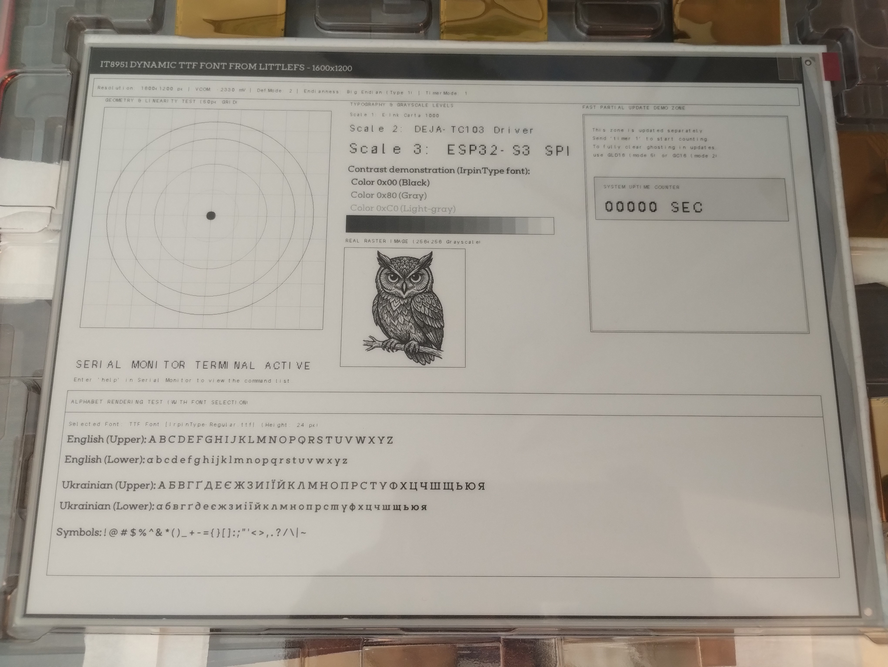

# epd-ite8951-gdep133ut3-esp32s3-driver

A high-performance C++ E-Ink driver for the **GDEP133UT3** (GoodDisplay, $1600 \times 1200$, 13.3") electronic paper display powered by the **iTE IT8951** TCON controller (**DEJA-TC103**) and an **ESP32-S3** microcontroller.

This library is heavily optimized for boards like the **DEJA-TC103**, leveraging **OPI PSRAM** for efficient framebuffering and featuring on-the-fly **TrueType (TTF) font rendering** alongside fully optimized Cyrillic layout handling.

---

## Hardware Used for Testing

1. TCON Board Demo Kit for 10.3" & 13.3" eTC E-Paper Displays, DEJA-TC103

IT8951 TTL parallel TCON board for 13.3" & 10.3" parallel-interface E-Ink displays, Arduino & ESP32 compatible, with USB & SPI interface for fast integration.

Link: https://www.good-display.com/product/472.html


3. 13.3" E Ink Carta 1000 Display – A4 Size, Wide Temperature eTC | GDEP133UT3

This 13.3-inch e-ink display features a wide operating temperature range (-15°C to 65°C), 1600×1200 resolution, 16 grayscale support, and a parallel interface for faster refresh performance.

Link: https://www.good-display.com/product/414.html


---

## 🚀 Key Features

* **Full 1600×1200 Resolution Support**: Native handling of 4bpp (16 levels of grayscale) image structures.
* **PSRAM Framebuffering**: The entire active canvas buffer (~960 KB) is allocated within the ESP32-S3's fast external PSRAM, preventing internal SRAM starvation.
* **On-the-Fly TTF Rendering**: Integrated directly with `stb_truetype.h`, enabling you to load any `.ttf` or `.otf` vector font files straight from LittleFS and render text dynamically with hardware-blended anti-aliasing.
* **Advanced Cyrillic Support**: Native conversion layer mapping UTF-8 sequences directly to Windows-1251 (CP1251) layout blocks, allowing flawless rendering of unique Ukrainian glyphs (`І`, `Ї`, `Є`, `ґ`).
* **Dynamic Waveform Clamping**: Complete structural routing for all IT8951 display waveforms, ranging from high-quality gray modes (`GC16`, `GLD16`) to ultra-fast binary refresh paths (`DU`, `A2`).
* **Smart Partial Refresh (`updateArea`)**: Targeted updates to specific localized coordinates directly from the PSRAM cache without causing global screen flashing.
* **Interactive Diagnostic Tool**: Includes a complete diagnostic sketch featuring a command-driven terminal over Serial for runtime hardware validation.

---

## 🔌 Hardware Wiring (SPI Configuration)

Typical hardware pin mapping configured for the ESP32-S3 (can be adjusted during initialization):

Use 14-pin FFC (Flexible Flat Cable).

| IT8951 / DEJA-TC103 TCON (SPI) | ESP32-S3 Pin | Description |
|--------------------------|--------------|-------------|
| **1.**                   | GND          | GNDD |
| **2. HOST_HRDY**         | GPIO 6       | Hardware Ready (Busy / Wait Signal) |
| **3. RESET**             | GPIO 7       | Hardware Reset |
| **4. SPI2_CS**           | GPIO 10      | Chip Select |
| **5. SPI2_SCK**          | GPIO 12      | Serial Clock |
| **6. SPI2_MOSI**         | GPIO 11      | Master Out Slave In |
| **7. SPI2_MISO**         | GPIO 13      | Master In Slave Out |
| **8.**                   | GND          | GNDD |
| **9. POWER_CTRL**        | GPIO 5       | Power Line Circuit Control (Optional) |
| **10.**                  | GND          | GNDD |
| **11.**                  | -            | Not connected |
| **12.**                  | +5V          | +5V |
| **13.**                  | +5V          | +5V |
| **14.**                  | +5V          | +5V |

---

## 🛠 Arduino IDE Compilation Settings

To compile projects using this library safely, you **must** configure the build target properties inside Arduino IDE precisely:

1. **Board**: *ESP32S3 Dev Module* (or your exact S3 vendor variant)
2. **PSRAM**: *Enabled (OPI)* ⚠️ **CRITICAL**: The massive 4bpp screen buffer requires active OPI PSRAM; otherwise, allocation will crash.
3. **Flash Size**: *8MB* or *16MB* (Match your physical chip capacity)
4. **Partition Scheme**: Select an array setup containing a large enough file system partition (e.g., *8MB Flash (3MB APP / 4MB LittleFS)*) to store your asset resources and TTF font families.

---

## 💻 Code Example: Basic Start

```cpp
#include <Arduino.h>
#include <LittleFS.h>
#include "IT8951.h"

IT8951Class display;

void setup() {
    Serial.begin(115200);
    
    if (!LittleFS.begin(true)) {
        Serial.println("[FS] LittleFS Mount Failed");
    }

    // Initialize display driver with local pin definitions
    // Parameters: vcom (mV), sck, miso, mosi, cs, hrdy, rst, pwr
    if (!display.begin(2330, 12, 13, 11, 10, 4, 5, 6)) {
        Serial.println("[EPD] Initialization Error!");
        while(1);
    }

    // Clean hardware ghosting lines
    display.clearScreen();
    delay(500);

    // Draw using standard built-in 8x16 bitmap font
    display.fill(0xFF); // Fill PSRAM buffer with White
    display.drawText(100, 100, "Hello E-Ink World!", 0x00, 0xFF, 2);
    display.updateArea(100, 100, 400, 32, UPDATE_MODE_GC16);

    // Load a custom Vector TrueType Font file from storage
    if (display.loadTTF(LittleFS, "/IrpinType-Regular.ttf", 48)) {
        display.drawTTFText(100, 300, "Beautiful Vector Text", 0x00, 0xFF, true);
        // Refresh area with ghosting-reduction mode
        display.updateArea(100, 260, 600, 60, UPDATE_MODE_GLD16);
    }
}

void loop() {
    // Active event loops
}
```

---

## Help command via Serial Monitor

```
=== E-INK CLASS LIBRARY GRAPHICS TERMINAL ===
Enter commands in Serial Monitor (terminate with newline):

--- SETTINGS ---
  help            - Show this help menu
  mode <0-2>      - Set default update mode:
                      0: INIT  (Full clearing, blinking, slow)
                      1: WDU   (Fast black/white update, 1-bit, no blinking)
                      2: GC16  (Full grayscale 16-level, 4-bit, RECOMMENDED)
                      * Modes 3-7 are not supported by this screen.
  endian <0/1>    - Change byte order (0: Little, 1: Big Endian)
  temp [C]        - Set temperature (no params - read built-in sensor)
  vcom            - Read current VCOM voltage from PMIC
  busy            - Read LUT drawing engine busy status (0x1224)
  info            - Output detailed device information (FW, LUT, size, buffer)

--- GENERAL OPERATIONS ---
  clear           - Fill buffer with white and fully update the screen
  init            - Hardware panel initialization cycle (INIT clear)
  dashboard       - Redraw the test dashboard to buffer and update
  sleep           - Put display to sleep mode (VCOM off)
  wakeup          - Wake up display from sleep mode (VCOM on)
  testmodes       - Run test of all update modes with timing measurement

--- AUTOMATIC TIMER ---
  timer <0/1> [m] - Enable(1)/Disable(0) auto-timer. Optional [m] sets mode (e.g. 'timer 1 1' for WDU)

--- DRAWING & LOCAL UPDATE (Coordinates and parameters) ---
  For high quality output use mode 2 (GC16), for fast text - mode 1 (WDU)
  update <x> <y> <w> <h> <mode>           - Update area from buffer (no memory allocation)
  rect <x> <y> <w> <h> <col> <fill> <m>   - Draw rectangle and update area
  circle <cx> <cy> <r> <col> <fill> <m>   - Draw circle and update area
  text <x> <y> <scale> <col> <bg> <msg>   - Draw text and update area
  cyrtext <x> <y> <scale> <col> <bg> <tr 0/1> <msg> - Draw beautiful Cyrillic text (CP1251)
  loadttf <height> <path>                            - Load new TTF font from LittleFS
  ttftext <x> <y> <color> <bg> <mode> <tr 0/1> <msg> - Draw anti-aliased TTF text
  filetext <x> <y> <color> <bg> <mode> <tr 0/1> <filePath> - Render text from file using TTF
  fileimg <x> <y> <w> <h> <bpp 4/8> <mode> <filePath>      - Render image from .bin file (4 or 8 bpp)
=============================================================================
```

---

## Test Code Output (Dashbord)



---

## 🎨 Waveform & Refresh Engine Configurations

The supported modes depends on your electronic paper display (**GDEP133UT3** in my case) and IT8951 controller driver (**DEJA-TC103** in my case) 

| Waveform Constant | Mode Integer | Is supported by GDEP133UT3 | Bit Depth	| Gray Levels	| Speed | Technical Description |
|-------------------|--------------|----------------------------|-----------|-------------|-------|-----------------------|
| UPDATE_MODE_INIT  | 0            | + | -     | -       | Very Slow  | Full hardware initialization and deep matrix clear (B/W inversion cycle) to eliminate residual electrical charges. |
| UPDATE_MODE_DU    | 1            | + | 1-bit | 2 (B/W) | Very Fast  | Direct Update: Fast monochrome update of pixels without flashing phases. Ideal for UI responsiveness and keyboard typing. |
| UPDATE_MODE_GC16  | 2            | + | 4-bit | 16      | Slow       | Global Clear: High-quality full-screen update with a complete clearing cycle. Provides reference image quality and zero ghosting. |
| UPDATE_MODE_GL16  | 3            | - | 4-bit | 16      | Medium     | Grayscale Local: Localized 16-level update optimized for light backgrounds. Refreshes changing pixels only, minimizing screen flash. |
| UPDATE_MODE_GLR16 | 4            | - | 4-bit | 16      | Mid-Fast   | Grayscale Local Reduced: Accelerated local 16-level update with a shortened waveform pulse and hardware ghosting reduction. |
| UPDATE_MODE_GLD16 | 5            | - | 4-bit | 16      | Mid-Fast   | Grayscale Local Dither: Local 16-level update utilizing hardware dithering algorithms to smooth out gradients and transitions. |
| UPDATE_MODE_A2    | 6            | - | 4-bit | 2 (B/W) | Ultra Fast | Animation Mode: Minimum possible response time designed for dynamic graphics, smooth scrolling, or real-time mouse cursor tracking. |
| UPDATE_MODE_DU4   | 7            | - | 2-bit | 4       | Slow       | Optimized fast update with 4 gray levels. A compromise between DU speed and basic grayscale capability. |

---

## 🤝 Credits & Acknowledgments
- The low-level register initializations and baseline SPI timing sequences are adapted from open-source reference implementations provided by **Good Display** (https://www.good-display.com).
- Font rendering capabilities are powered by the excellent public-domain stb_truetype.h parser by Sean Barrett. (https://github.com/nothings/stb/blob/master/stb_truetype.h)
